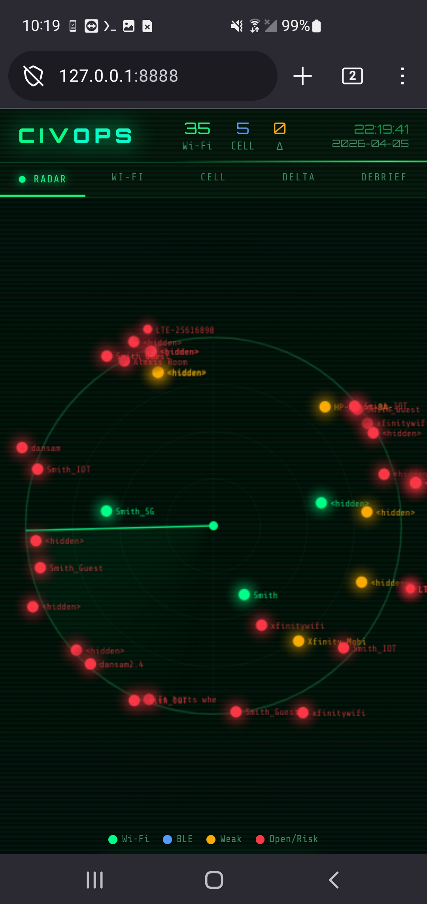
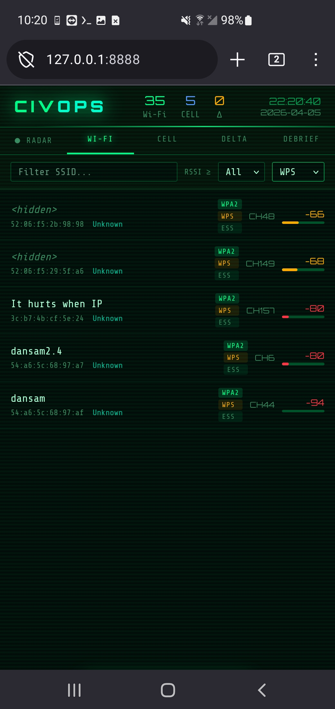
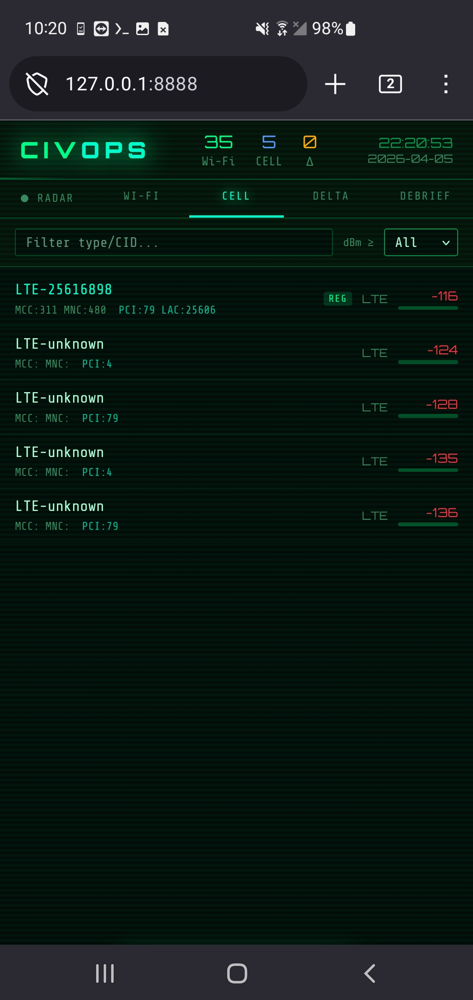

# CIVOPS — Signal Recon Platform
### Termux Edition v1.0.0

> Android-based civilian signal reconnaissance. Wi-Fi + Cell tower scanning, tactical radar HUD, delta tracking, and structured LLM debrief export. Fully offline. No cloud. No API keys.

---

## What It Does

CIVOPS turns an Android phone running Termux into a passive signal intelligence platform. It continuously scans nearby Wi-Fi networks and cellular towers, logs everything to a local SQLite database, and visualizes the results on a tactical radar HUD served to your browser at `http://127.0.0.1:8888`.


---

## Features

| Feature | Description |
|---|---|
| **Radar HUD** | Live satellite-style sweep with signal blips color-coded by RSSI and security |
| **Wi-Fi Scanner** | SSIDs, BSSIDs, RSSI, channel, security flags (WPA2/WPA/WEP/OPEN/WPS), vendor |
| **Cell Scanner** | LTE/WCDMA/GSM tower detection, serving tower identification, carrier lookup |
| **Delta Timeline** | Tracks NEW / LOST / RETURNING signal events in real time |
| **Debrief Export** | One-tap LLM-ready prompt summarizing the signal environment — paste into any AI |
| **Filtering** | Filter all views by signal strength, name pattern, security type |
| **Fully Offline** | No internet required after install. No telemetry. No cloud dependency. |


---

## Screenshots
| Radar View | WiFi Status | Cellular Data |
| :---: | :---: | :---: |
|  |  |  |

---

## Requirements

| Requirement | Notes |
|---|---|
| Android 8+ | API 26 minimum |
| [Termux](https://f-droid.org/en/packages/com.termux/) | Install from **F-Droid only** |
| [Termux:API](https://f-droid.org/en/packages/com.termux.api/) | Install from **F-Droid only** |
| Location permission | Required by Android OS for Wi-Fi scanning |
| Wi-Fi enabled | For Wi-Fi scans |
| Phone permission | For cell tower data (optional) |

> ⚠️ **Do not install Termux or Termux:API from the Google Play Store.** The Play Store versions are outdated and missing critical API support. Use F-Droid.

---

## Install

### Option A — Clone with Git (recommended)
```bash
# In Termux
pkg install git
git clone https://github.com/jermsmit/civops.git ~/civops
bash ~/civops/install.sh
```

### Option B — Manual file transfer
Copy the repository files to your device, then:
```bash
# If files landed in Downloads:
cp -r /sdcard/Download/civops ~/civops

# Run installer
bash ~/civops/install.sh
```

The installer will:
- Install `python` and `termux-api` packages
- Create the correct directory structure
- Request location permission
- Test Wi-Fi and cell scan connectivity
- Create the `civops` shell alias

---

## Start

```bash
source ~/.bashrc && civops
```

Or directly:
```bash
bash ~/civops/civops.sh
```

CIVOPS will open your browser automatically. If it doesn't, navigate manually to:
```
http://127.0.0.1:8888
```

Custom port:
```bash
CIVOPS_PORT=9000 bash ~/civops/civops.sh
```

Stop with `Ctrl+C` in the Termux session.

---

## Permissions Setup

If scans return no data, the most common cause is missing permissions. Go to:

**Android Settings → Apps → See all apps → Termux:API → Permissions**
- Location → **Allow all the time**
- Nearby devices → Allow (Android 12+)
- Phone → Allow (for cell tower data)

**Android Settings → Apps → See all apps → Termux → Permissions**
- Location → **Allow all the time**

After granting permissions, restart CIVOPS.

---

## File Structure

```
civops/
├── install.sh              # Termux setup script
├── civops.sh               # Launch script (created by installer)
├── README.md
├── backend/
│   └── server.py           # Scanner daemon + SQLite + HTTP API
└── frontend/
    └── index.html          # Tactical HUD (single file, fully offline)
```

Data is stored at `~/.civops/civops.db` (SQLite).

---

## API Reference

All endpoints served at `http://127.0.0.1:8888`

| Endpoint | Description |
|---|---|
| `GET /api/live` | Current signals from latest scan |
| `GET /api/signals?mins=60&source=wifi&min_rssi=-80&pattern=home` | Filtered signal history |
| `GET /api/deltas?mins=30` | Recent new/lost/returning events |
| `GET /api/timeline?mins=60` | Scan history with counts per source |
| `GET /api/debrief?mins=30` | Full LLM-ready debrief package |
| `GET /api/status` | Server status, last scan summary |

---

## Debrief Workflow

1. Open the **DEBRIEF** tab
2. Select time window (15 / 30 / 60 min)
3. Tap **GENERATE**
4. Tap **COPY PROMPT**
5. Paste into ChatGPT, Claude, Gemini, or any LLM

The prompt includes Wi-Fi signal summary, cell tower picture, delta events, and pre-written analysis questions. No API key required. No data leaves the device.

---

## Radar Color Key

| Color | Meaning |
|---|---|
| 🟢 Green | Wi-Fi — strong signal |
| 🔵 Blue | Cell tower |
| 🟡 Yellow | Weak signal (any source) |
| 🔴 Red | Open/unencrypted network or very weak signal |

Signal position on radar reflects RSSI strength — stronger signals appear closer to center.

---

## Known Limitations

**Android scan throttling** — Android 9+ limits Wi-Fi scans to approximately 4 per 2 minutes. On Android 10+, the effective rate is roughly one scan per 30 seconds regardless of the configured interval. This is an OS-level restriction, not a bug.

**RSSI distance estimation** — Signal strength is a noisy proxy for distance. Wall attenuation, antenna variation, and RF interference all affect readings. Treat position on radar as relative, not absolute.

**BLE scanning** — Bluetooth Low Energy scanning is not supported in this release. The `termux-bluetooth-scaninfo` command was removed from Termux:API in recent versions and there is no viable replacement for passive BLE scanning on Android without root. BLE support is planned for the Linux port.

**OUI vendor lookup** — Uses a partial offline table. Uncommon or enterprise hardware may show "Unknown".

**Cell carrier lookup** — Uses a partial offline MCC/MNC table focused on US carriers. International carriers may show raw MCC/MNC values instead of carrier names.

---

## Roadmap

- [ ] Linux port (adapter layer for `iw`, `nmcli`, `bluetoothctl`)
- [ ] BLE scanning (Linux only via `bluetoothctl`)
- [ ] Expanded OUI table
- [ ] Expanded MCC/MNC carrier table
- [ ] `termux-sensor` integration (accelerometer/motion context)
- [ ] Session export to JSON file
- [ ] Scan history comparison across sessions

---

## Uninstall

To fully remove CIVOPS from your device:

```bash
# 1. Stop the server if running
pkill -f server.py

# 2. Remove the CIVOPS directory
rm -rf ~/civops

# 3. Remove the data directory (scan history database)
rm -rf ~/.civops

# 4. Remove the shell alias from ~/.bashrc
sed -i '/alias civops=/d' ~/.bashrc

# 5. Reload shell
source ~/.bashrc
```

To also uninstall the packages installed by CIVOPS:
```bash
# Only do this if you don't use these packages for anything else
pkg uninstall termux-api
```

To uninstall the Termux:API companion app, remove it through Android Settings → Apps like any other app.

---

## Notes on Privacy

CIVOPS operates entirely on-device. It does not transmit scan data anywhere, does not require an internet connection after install, and does not contact any external service. The debrief export feature generates a text prompt that you manually paste into a tool of your choosing — no automatic API calls are made.

Location permission is required by Android's Wi-Fi scanning API (`WifiManager`). CIVOPS does not use GPS or request precise location data.

---

## License

MIT
